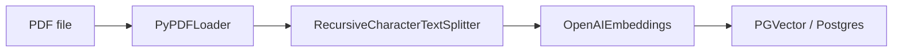
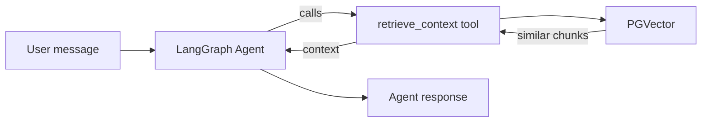

# Week 11 — RAG Agent with LangGraph Studio

RAG agent that answers questions about Guatemalan law using **LangChain**, **PGVector**, and **LangGraph**.  
Documents are loaded with [`ingestor.py`](ingestor.py), and the agent (tool-calling RAG) is served through **LangGraph Studio** via [`langgraph.json`](langgraph.json).

## Tech stack

- **Python** 3.14+ (see [`.python-version`](.python-version) / [`pyproject.toml`](pyproject.toml))
- **LangChain** — `langchain-community`, `langchain-openai`, `langchain-postgres`
- **LangGraph** — agent runtime + Studio UI (`langgraph-cli[inmem]`)
- **Embeddings** — OpenAI `text-embedding-3-large`
- **LLM** — OpenAI `gpt-5.2`
- **Vector DB** — PostgreSQL with **pgvector** (Docker)
- **Package manager** — [uv](https://github.com/astral-sh/uv)

## Architecture

### Ingestion (indexing)

[`ingestor.py`](ingestor.py) accepts any PDF path as a CLI argument: load → split → embed → persist.



### Agent (tool-calling RAG)

The agent decides when to call the `retrieve_context` tool, which performs a similarity search on PGVector and returns the relevant chunks.



### Components

| File | Role |
| --- | --- |
| [`ingestor.py`](ingestor.py) | CLI script — loads a PDF, splits into chunks, writes embeddings to PGVector (`collection_name="codigos_de_guatemala"`). |
| [`agent.py`](agent.py) | Defines the LangGraph agent with a `retrieve_context` tool and a Spanish-only system prompt. |
| [`chain.py`](chain.py) | Simpler chain-based RAG (middleware approach) — useful for comparison. |
| [`langgraph.json`](langgraph.json) | Registers the graph as **`law_agent`** for LangGraph Studio. |
| [`compose.yml`](compose.yml) | Runs `pgvector/pgvector:pg18-trixie` on port `5432`. |

## Prerequisites

- [Docker](https://docs.docker.com/get-docker/) (Compose v2)
- [uv](https://docs.astral.sh/uv/)
- An **OpenAI API key** (`OPENAI_API_KEY`)

## Setup

### 1. Start PostgreSQL with pgvector

```bash
docker compose -f compose.yml up -d
```

Create the `agentdb` database (first time only):

```bash
docker exec -it pg-vector psql -U postgres -c "CREATE DATABASE agentdb;"
```

### 2. Python environment and dependencies

```bash
cd week-11
uv venv
source .venv/bin/activate   # Windows: .venv\Scripts\activate
uv sync
```

### 3. Environment variables

Create a `.env` in `week-11`:

```bash
OPENAI_API_KEY=sk-...
```

### 4. Ingest documents

Pass the path to the PDF you want to index:

```bash
uv run python ingestor.py ./docs/codigo-de-trabajo.pdf
```

You can ingest additional PDFs by running the command again with a different path:

```bash
uv run python ingestor.py ./docs/another-law.pdf
```

## Running

### LangGraph Studio (dev server)

[`langgraph.json`](langgraph.json) registers the graph as **`law_agent`**, loaded from `agent.py` (`agent`).

```bash
langgraph dev
```

Open the URL the CLI prints (LangGraph Studio) to run threads, inspect state, and try the agent with the configured tools and `.env`.

### Chain (CLI)

For a quick terminal-based RAG session using the chain approach:

```bash
uv run python chain.py
```

## References

- [LangGraph — Build an Agent](https://langchain-ai.github.io/langgraph/tutorials/introduction/)
- [LangGraph Studio](https://langchain-ai.github.io/langgraph/concepts/langgraph_studio/)
- [Build a RAG agent with LangChain](https://docs.langchain.com/oss/python/langchain/rag)
